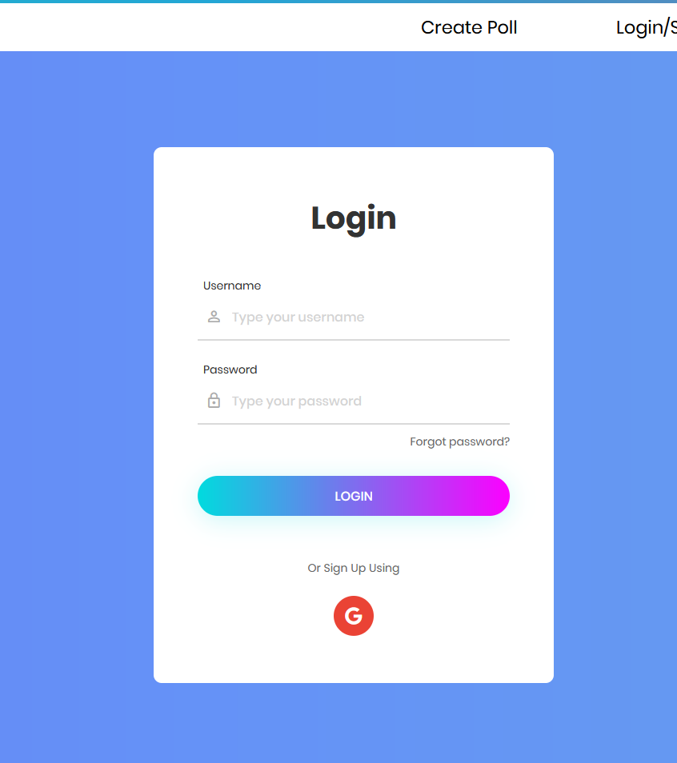
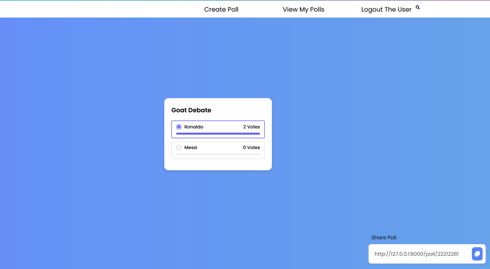
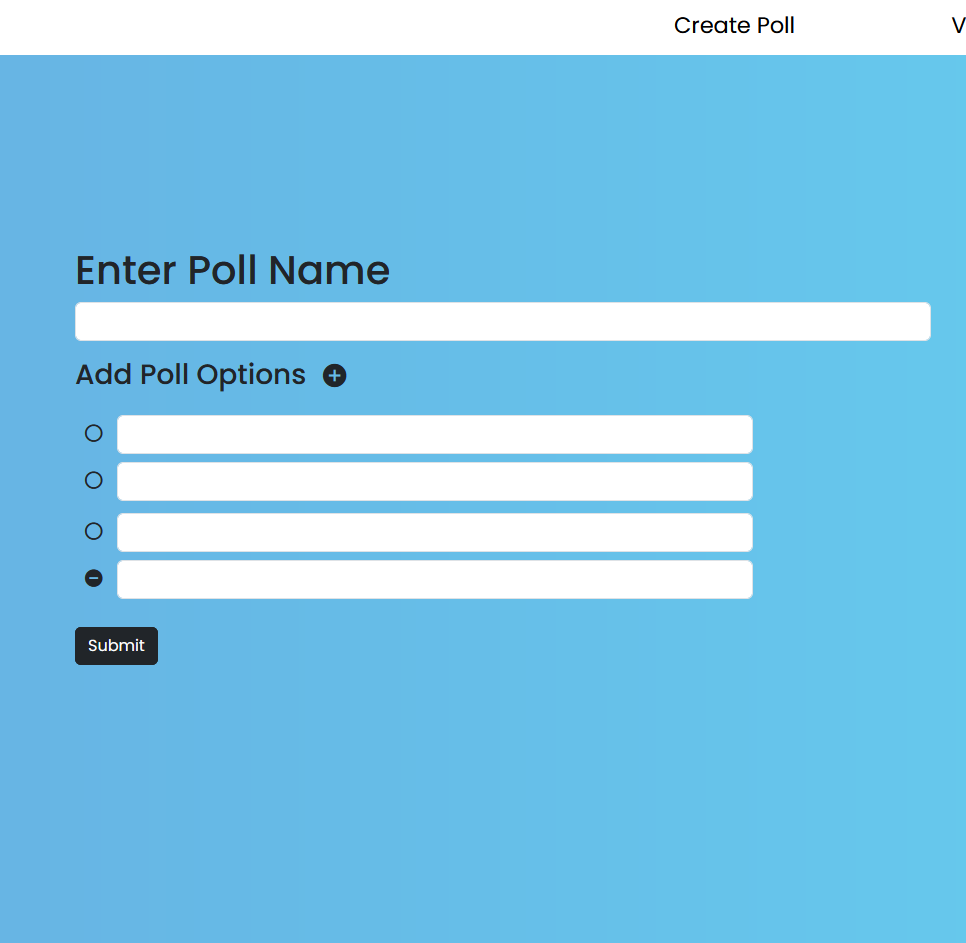
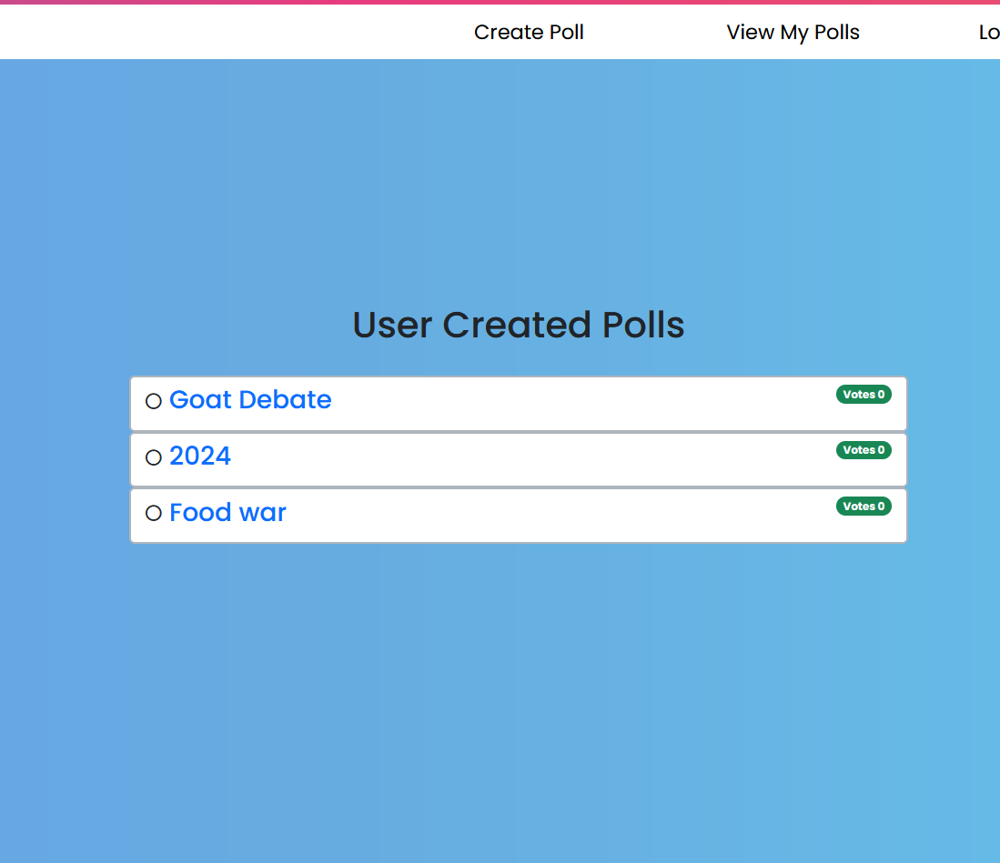

# Live-Poll
Live and Interactive Polls using websockets

# Installation
* 1 - clone repo https://github.com/mujtaba-jpj/Live-Poll.git
* 2 - create a virtual environment and activate
*  - pip install virtualenv
*  - virtualenv envname
*  - envname\scripts\activate
* 3 - cd into project "cd DevSearch"
* 4 - pip install -r requirements.txt
* 5 - python manage.py runserver

# Features
* Create Polls
* Share them with other users
* Vote on other Polls
* See the results in realtime through websockets

# Project Overview
* Basic Django Overview
* Websockets implementation
* Database Design and Models
* Static Files
* User Registration & Authenticaiton ( Google oauth implementation)

# Tech Stack
* Django
* sqlite
* Django Channels
* Redis

# Home Page
  

# Login Page
  

# Poll Page
  

# Poll Creation Page
  

# My Polls page
  

